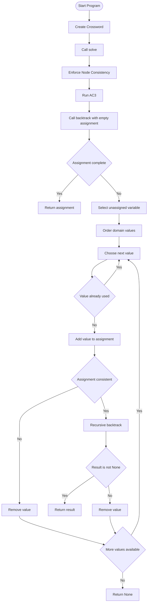

# Crossword — CS50 AI (Week 3) - Software Development Learning Cycle

## Planning

### Goal
The goal of this program is to generate a completed crossword puzzle.

To accomplish this, the following eight core functions must be implemented:

1. **Enforce Node Consistency**  
   Filters each variable’s domain so that only words of the correct length remain. Words that do not match the required slot length are removed.

2. **Revise**  
   Ensures a consistent arc between two variables. If a word in variable **X** has no matching word in variable **Y** that satisfies the overlapping letter constraint, that word is removed from **X's domain**.

3. **AC3 (Arc Consistency Algorithm)**  
   Repeatedly applies the **revise** function (see above) across pairs of variables (arcs). The goal is to ensure that every remaining value for one variable has a compatible value in its neighboring variable.

4. **Assignment Complete**  
   Determines whether a crossword assignment is finished by checking if every variable has been assigned a word.

5. **Consistent**  
   Checks whether a partial assignment follows all crossword rules:
   - Words must match the required length
   - Words cannot repeat
   - Overlapping characters between variables must match

6. **Order Domain Values**  
   Returns the possible words for a variable ordered by the **least-constraining value heuristic**(selects the value for a variable that rules out the fewest options for neighboring variables). Words that eliminate the fewest options for neighboring variables are considered first.

7. **Select Unassigned Variable**  
   Chooses the next variable to assign using two heuristics:
   - The variable with the smallest domain
   - If tied, choose the variable with the most neighbors

8. **Backtrack**  
   Uses recursive **backtracking search** to attempt assignments. Words are assigned one at a time while maintaining consistency until a complete solution is found or all options are attempted.

---

### Success Criteria
The program is considered successful if it can:

- Accept a crossword structure file and a word list
- Apply CSP algorithms to enforce constraints
- Generate a valid crossword solution
- Display the solved crossword in the terminal

---

### Project Requirements
- The file **`crossword.py` must remain unchanged**.
- Modifications are only allowed inside **`generate.py`**, specifically in the CSP functions.
- Additional helper functions may be created if necessary.
- Only standard Python libraries and the provided modules may be used.

---

## Analysis

### Tools and Resources
The following components were provided for the project:

- **Crossword structure file**: This defines the puzzle layout
- **Word list dictionary**: The possible domain values
- **`crossword.py`**: This defines crossword variables, neighbors, and overlaps
- **`generate.py`**:This is where implementation is required as it is partially completed, acting as the framework.

---

### Timeline & Steps

1. **Implement `enforce_node_consistency()`**
   - Remove any words from a variable’s domain that do not match the required slot length.

2. **Implement `revise(x, y)`**
   - Compare words in variable **X** with words in variable **Y**.
   - Remove words from **X** if they cannot satisfy the overlap constraint.
   - Return `True` if changes were made, otherwise return `False`.

3. **Implement `ac3()`**
   - Initialize a queue containing all arcs in the crossword.
   - Repeatedly enforce arc consistency between variable pairs.
   - If any domain becomes empty, the puzzle has no solution.

4. **Implement `assignment_complete()`**
   - Check if every crossword variable has been assigned a word.

5. **Implement `consistent()`**
   - Verify that the current assignment follows all constraints:
     - Correct word lengths
     - No repeated words
     - Matching overlapping characters

6. **Implement `order_domain_values()`**
   - Sort domain values by how many neighbor domain values they eliminate.
   - Words that eliminate the fewest options are prioritized.

7. **Implement `select_unassigned_variable()`**
   - Choose the next variable using:
     - Minimum Remaining Values heuristic
     - Degree heuristic as a tiebreaker

8. **Implement `backtrack()`**
   - Use recursive backtracking to try possible assignments.
   - Continue searching until a valid solution is found or all possibilities fail.

---

### Troubleshooting Techniques

Several debugging strategies were used during development:

- Print statements to observe domain changes and assignments
- Running functions individually to isolate errors
- Checking domain reductions to ensure constraints were applied correctly
- Testing with smaller crossword structures to verify algorithm behavior

### Flowchart

This is the flowchart programmed in `mermaid`:

